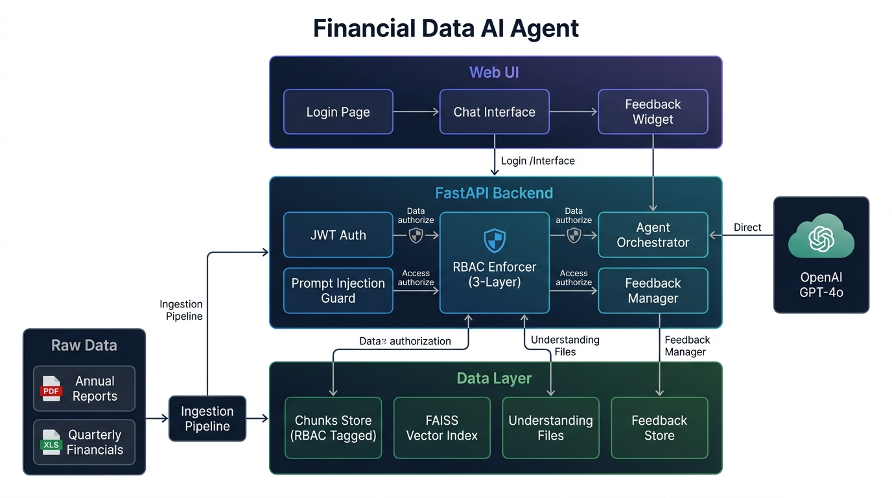

# Agentio — Financial Data AI Agent

An agentic financial data assistant that ingests Apple's SEC filings (PDF 10-K annual reports + XLS quarterly financials), enforces **role-based access control at the data layer**, learns from user feedback, and defends against **prompt injection attacks**.

**Tech Stack:** Python 3.11+ · FastAPI · OpenAI GPT-4o · FAISS · Render + Vercel

---

## Architecture



### Query Flow

```
User Query
  │
  ├─ 1. Input Guard ─────── Prompt injection detection (regex + base64 + role confusion)
  │
  ├─ 2. JWT Auth ─────────── Token validation, user role extraction
  │
  ├─ 3. RBAC Pre-Filter ──── Restricted data categories excluded from search space
  │
  ├─ 4. FAISS Retrieval ──── Semantic search over allowed chunks (with feedback penalties)
  │
  ├─ 5. RBAC Post-Filter ─── Second pass removes any restricted chunks that slipped through
  │
  ├─ 6. LLM Generation ──── GPT-4o generates answer with few-shot examples from feedback
  │
  └─ 7. Output Validation ── Canary token check + leakage scan → re-generate if unsafe
```

---

## Running Locally

### 1. Clone the Repository

```bash
git clone https://github.com/your-username/Agentio.git
cd Agentio
```

### 2. Install Dependencies

```bash
pip install -r backend/requirements.txt
```

### 3. Set Up Environment Variables

Copy the example file and fill in your keys:

```bash
cp .env.example .env
```

Open `.env` and set the following:

```env
# REQUIRED — Your OpenAI API key (get one at https://platform.openai.com/api-keys)
OPENAI_API_KEY=sk-proj-your-key-here

# REQUIRED — A strong secret for signing JWT tokens
# Generate a 64-byte random secret using:
#   python -c "import secrets; print(secrets.token_urlsafe(64))"
# or:
#   openssl rand -base64 64
JWT_SECRET=your-strong-64-byte-secret-here

# OPTIONAL — Port for local server (default: 8000)
PORT=8000
```

> **Important:** The `JWT_SECRET` should be a cryptographically random string of at least 64 bytes. Never commit real secrets to version control. The `.env` file is already in `.gitignore`.

### 4. Run Data Ingestion

```bash
python -m backend.ingestion.run_ingestion
```

This will:
- Parse all PDFs in `data/` using dual extraction (PyMuPDF for text + pdfplumber for tables)
- Parse all XLS files using xlrd
- Split documents into token-aware chunks (800 tokens, 100 token overlap)
- Generate OpenAI embeddings and build a FAISS vector index
- Create pre-computed understanding files (summaries, metrics, glossary)

### 5. Start the Server

```bash
python -m backend.main
```

Open [http://localhost:8000](http://localhost:8000) in your browser.

---

## Demo Accounts

Click on any role card on the login page to auto-fill credentials, or use these:

| Role | Email | Password | Access Level |
|------|-------|----------|--------------|
| **CEO** | ceo@apple.com | ceo123 | Full access to all data |
| **CTO** | cto@apple.com | cto123 | No headcount / compensation data |
| **CFO** | cfo@apple.com | cfo123 | No strategy / R&D / legal data |

---

## RBAC — Three-Layer Enforcement

```
Layer 1 │ PRE-RETRIEVAL    │ Restricted categories excluded from FAISS search space
Layer 2 │ POST-RETRIEVAL   │ Second-pass filter removes any restricted chunks
Layer 3 │ OUTPUT VALIDATION │ LLM response scanned for leakage → auto re-generation
```

The LLM **never sees** restricted data — making leakage structurally impossible at Layer 1, with Layers 2–3 as defense-in-depth.

---

## Project Structure

```
Agentio/
├── backend/
│   ├── main.py                  # FastAPI app, routes, middleware
│   ├── config.py                # Central config, paths, RBAC roles
│   ├── agent/
│   │   └── orchestrator.py      # Core agent: retrieval, prompt building, LLM calls
│   ├── ingestion/
│   │   ├── run_ingestion.py     # End-to-end ingestion pipeline
│   │   ├── pdf_parser.py        # PyMuPDF + pdfplumber dual extraction
│   │   ├── excel_parser.py      # xlrd for legacy XLS format
│   │   └── chunker.py           # Token-aware splitting (tiktoken)
│   ├── rbac/
│   │   ├── enforcer.py          # Pre/post retrieval filters + leakage detection
│   │   ├── auth.py              # JWT authentication
│   │   └── models.py            # Pydantic request/response models
│   ├── security/
│   │   └── injection_guard.py   # Input sanitization + output validation
│   ├── understanding/
│   │   └── generator.py         # Pre-computed summaries, metrics, glossary
│   └── feedback/
│       └── manager.py           # Feedback storage, few-shot examples, penalties
├── frontend/
│   ├── index.html               # Single-page application
│   ├── app.js                   # Frontend logic and API client
│   └── styles.css               # UI styling
├── data/                        # Raw SEC filings (PDFs + XLS)
├── processed/                   # Generated chunks, embeddings, understanding files
├── docs/
│   └── architecture.png         # System architecture diagram
├── test_e2e.py                  # End-to-end API test suite
├── Procfile                     # Render deployment (Gunicorn + Uvicorn)
└── vercel.json                  # Vercel frontend deployment config
```

---

## API Endpoints

| Method | Endpoint | Auth | Description |
|--------|----------|------|-------------|
| POST | `/api/auth/login` | No | Authenticate with email and password |
| GET | `/api/auth/me` | JWT | Get current user info and permissions |
| POST | `/api/query` | JWT | Ask a natural language financial question |
| POST | `/api/feedback` | JWT | Submit feedback (thumbs up/down + corrections) |
| GET | `/api/feedback/stats` | JWT | Retrieve feedback statistics |
| GET | `/api/system/roles` | No | List available roles and permissions |

---

## Testing

Start the server, then in a separate terminal:

```bash
python test_e2e.py
```

This runs authentication, RBAC query filtering, prompt injection detection, and feedback tests.

---

## Design Decisions

**Data Ingestion**
- PDFs: Dual extraction with pymupdf (text) + pdfplumber (tables) for maximum coverage
- Excel: xlrd for legacy .xls BIFF format, preserving table structure as markdown
- Chunking: Token-aware splitting (tiktoken, cl100k_base) with overlap, never splitting mid-row

**Understanding Layer**
- Pre-computed: Per-file summaries, key financial metrics, data category index, Excel schema notes, financial glossary
- On-the-fly: Cross-document comparisons, trend analysis, user-specific context, derived calculations

**Feedback Loop**
1. Corrections become few-shot examples injected into future similar queries
2. Negative ratings penalize retrieval sources in future ranking
3. Quality tracking monitors positive rate and common correction topics

**Prompt Injection Defense**
- Input Guard: 20+ regex patterns + base64 decode attacks + role confusion detection
- Document Sanitization: Embedded AI instructions stripped during ingestion
- Output Validation: Canary token detection + sensitive pattern redaction
- System Prompt Hardening: Explicit anti-injection rules

---

## License

This project is for educational and demonstration purposes.
